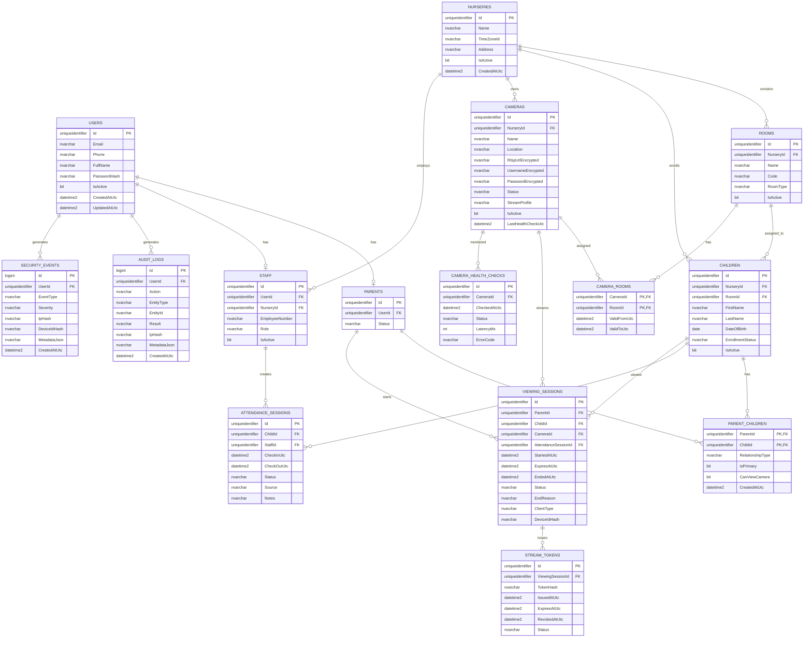
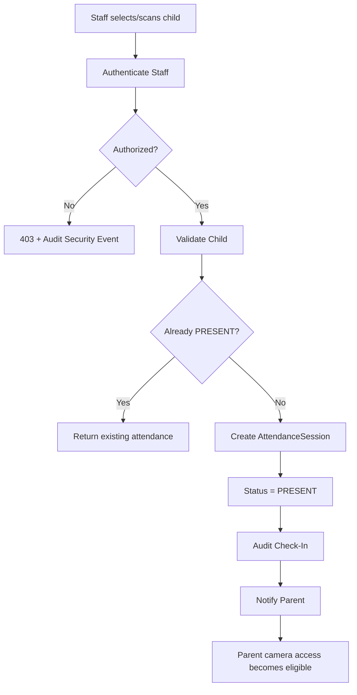
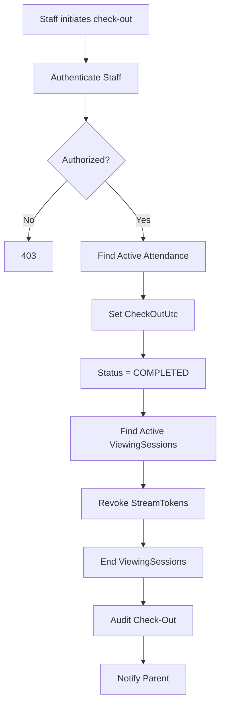
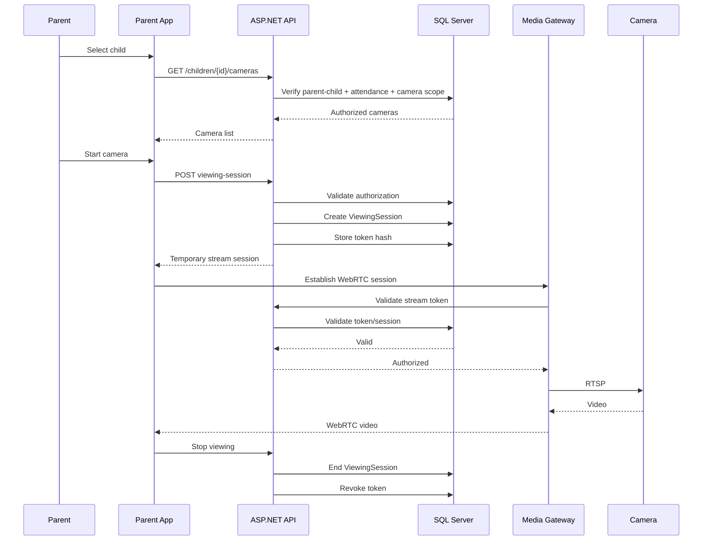

# Cursor AI — Nursery Camera Monitoring System Specification

> **Purpose:** Source-of-truth implementation specification for Cursor AI / Cursor Agent.
>
> **Mandatory instruction:** Read this entire file before generating or modifying code. Treat the architecture, security rules, business rules, ERD, flows, API contracts, and acceptance criteria as mandatory unless explicitly overridden by the user.
>
> **Primary stack:** .NET 8+, ASP.NET Core, EF Core, SQL Server, Angular, Redis, SignalR, Docker, WebRTC-compatible media gateway.
>
> **Critical security rule:** Camera access is never direct. Never expose RTSP URLs or camera credentials. All parent camera access must be authorized server-side through Parent → Child → Attendance → Room → Camera → Viewing Session → Temporary Stream Token.

---

# Nursery Camera Monitoring System — AI Coding Agent Specification

Version: 1.0
Target stack: ASP.NET Core / .NET 8+, SQL Server, Angular, Redis, SignalR, Docker
Architecture: Clean Architecture + CQRS/MediatR-style application layer
Primary objective: Allow authorized parents to view live nursery cameras only while their child is physically present and only for cameras/scopes explicitly permitted by the nursery.

---

# 1. Product Scope

The system manages:

- Nurseries and physical locations.
- Rooms/classes.
- Children and parent relationships.
- Staff and staff permissions.
- Attendance/check-in/check-out.
- IP cameras.
- Camera-to-room/class assignments.
- Parent camera access policies.
- Short-lived live viewing sessions.
- Temporary stream authorization tokens.
- Camera health monitoring.
- Notifications.
- Audit/security events.

The first MVP should be LIVE-ONLY.

Do NOT implement video recording by default.

Do NOT expose camera RTSP URLs to browsers, parents, or mobile applications.

The camera network must be isolated from the public Internet whenever possible.

---

# 2. Core Business Rules

BR-001: A user must authenticate before accessing protected resources.

BR-002: Only users with an active Parent profile can request parent camera access.

BR-003: A parent can access only children linked through ParentChildren.

BR-004: A parent can access a camera only if that camera is assigned to a room/class associated with the selected child.

BR-005: The child must currently have an active attendance session for live viewing to be allowed.

BR-006: Camera must be active and healthy enough to start a stream.

BR-007: A viewing session must have a finite expiration time.

BR-008: Stream authorization tokens must be short-lived and must never contain the RTSP URL.

BR-009: When a child's attendance session ends, all active viewing sessions for that child must be terminated/revoked.

BR-010: When a child is checked out, all active stream tokens for that child must become invalid.

BR-011: Every stream start, stream stop, authorization denial, token issuance, and security-sensitive action must be auditable.

BR-012: Parent must never receive direct access to camera infrastructure.

BR-013: Parent must never be able to enumerate cameras outside the authorized child scope.

BR-014: API responses must not expose internal camera credentials.

BR-015: Camera credentials and RTSP URLs must be encrypted at rest.

BR-016: Camera credentials must never appear in application logs.

BR-017: Access control must be enforced server-side. Client-side hiding is not authorization.

BR-018: A parent may have multiple children.

BR-019: A child may have multiple authorized parents/guardians.

BR-020: Nursery administrators may configure camera access policies.

BR-021: Staff permissions must be role/policy based.

BR-022: System must fail closed: if authorization state cannot be determined, streaming is denied.

BR-023: All timestamps are stored in UTC. Nursery timezone is used for presentation and policy calculations.

BR-024: Attendance is the source of truth for whether the child is physically present.

BR-025: A manually created attendance session must be audited with actor, reason, timestamp, and source.

---

# 3. Actors

## Parent

Can:

- Login.
- View own children.
- View current attendance state.
- List cameras authorized for a selected child.
- Start a live viewing session.
- Stop a live viewing session.
- View own viewing history where allowed by policy.
- Receive attendance/stream notifications.

Cannot:

- Access other children.
- Access arbitrary cameras.
- Access RTSP.
- Modify attendance.
- Modify camera configuration.
- View administrative audit logs.

## Nursery Administrator

Can:

- Manage nursery.
- Manage rooms/classes.
- Manage users/staff.
- Manage children.
- Manage parent relationships.
- Manage cameras.
- Assign cameras to rooms/classes.
- Configure viewing policies.
- View attendance.
- View active viewing sessions.
- View audit/security events.
- Disable cameras.

## Staff

Can:

- Perform authorized check-in.
- Perform authorized check-out.
- View children in assigned scope.
- View camera health if permitted.

Staff cannot automatically inherit administrative permissions.

## System/Background Worker

Can:

- Monitor camera health.
- Expire viewing sessions.
- Revoke expired stream tokens.
- Send notifications.
- Detect abnormal session behavior.
- Produce health/security events.

---

# 4. System Architecture

```text
                         Internet
                            |
                    HTTPS / WebSocket
                            |
                +-----------v-----------+
                | Reverse Proxy / WAF  |
                +-----------+-----------+
                            |
                +-----------v-----------+
                | ASP.NET Core API      |
                | Authentication       |
                | Authorization        |
                | Business Logic       |
                +--+-------+-------+---+
                   |       |       |
             +-----v--+ +--v---+ +-v--------+
             | SQL     | |Redis | | SignalR  |
             | Server  | |Cache | | Hub      |
             +---------+ +------+ +----------+
                   |
             +-----v----------------+
             | Media Gateway        |
             | WebRTC / HLS boundary |
             +----------+-----------+
                        |
                 Private Network
                        |
              +---------v----------+
              | RTSP IP Cameras    |
              +--------------------+
```

Recommended physical deployment:

```text
Public Zone
  |
  +-- Reverse Proxy
  +-- API
  +-- Frontend
  +-- SignalR
  +-- Media Gateway signaling

Private Camera VLAN
  |
  +-- Camera 01
  +-- Camera 02
  +-- Camera N
```

Camera RTSP endpoints must not be publicly routable.

---

# 5. Recommended Repository Structure

```text
src/
  NurseryCamera.Api/
    Controllers/
    Hubs/
    Middleware/
    Filters/
    Program.cs

  NurseryCamera.Application/
    Abstractions/
      Persistence/
      Identity/
      Streaming/
      Notifications/
      Caching/
      Time/
    Behaviors/
    Common/
    Features/
      Auth/
      Children/
      Parents/
      Attendance/
      Cameras/
      ViewingSessions/
      Notifications/
      Administration/

  NurseryCamera.Domain/
    Entities/
    Enums/
    ValueObjects/
    Events/
    Exceptions/

  NurseryCamera.Infrastructure/
    Persistence/
      Configurations/
      Migrations/
      AppDbContext.cs
    Identity/
    Streaming/
    Notifications/
    Caching/
    BackgroundJobs/

tests/
  NurseryCamera.UnitTests/
  NurseryCamera.IntegrationTests/
  NurseryCamera.ApiTests/
```

---

# 6. ERD

## Mermaid ERD



---

# 7. Entity Rules

## Users

Unique indexes:

- Email
- normalized email
- Phone where required

Never return PasswordHash through API DTOs.

Prefer ASP.NET Core Identity rather than implementing password hashing manually.

## Parents

One User may have one Parent profile.

## ParentChildren

Composite primary key:

```text
ParentId + ChildId
```

Unique relationship.

CanViewCamera must be checked in addition to authentication.

## Children

A child belongs to exactly one nursery in the MVP.

A child may be assigned to one active room/class at a time.

If room history is needed later, introduce ChildRoomAssignments.

## Cameras

Camera secret fields must be encrypted using an application-managed encryption service.

Never log decrypted values.

Recommended status:

```text
ACTIVE
INACTIVE
OFFLINE
MAINTENANCE
ERROR
```

## AttendanceSession

Recommended status:

```text
PRESENT
COMPLETED
CANCELLED
CORRECTED
```

Invariant:

```text
At most one active PRESENT attendance session per child.
```

## ViewingSession

Recommended status:

```text
PENDING
ACTIVE
ENDED
EXPIRED
REVOKED
DENIED
```

EndReason:

```text
PARENT_STOPPED
CHILD_CHECKED_OUT
TOKEN_EXPIRED
SESSION_EXPIRED
CAMERA_OFFLINE
ADMIN_REVOKED
SECURITY_POLICY
SYSTEM_ERROR
```

---

# 8. Parent Camera Authorization Algorithm

Endpoint:

```http
POST /api/children/{childId}/cameras/{cameraId}/viewing-sessions
```

Server algorithm:

```text
1. Authenticate user.
2. Resolve Parent profile.
3. Verify Parent is active.
4. Verify ParentChildren relation exists.
5. Verify ParentChildren.CanViewCamera == true.
6. Verify Child exists and is active.
7. Verify Child belongs to Parent's nursery context.
8. Find active AttendanceSession for child.
9. If no active attendance session => DENY.
10. Find active Child.RoomId.
11. Verify camera is assigned to Child.RoomId.
12. Verify camera is active.
13. Verify camera is healthy / available.
14. Verify nursery viewing policy allows viewing now.
15. Check parent's concurrent session limit.
16. Create ViewingSession.
17. Generate cryptographically random stream token.
18. Store only token hash in database.
19. Return media gateway session information.
20. Write AuditLog.
21. Publish SignalR event if required.
```

The API must fail closed on any authorization uncertainty.

---

# 9. Check-In Flow



Important:

Camera access does not become automatically active just because the child exists.

It becomes eligible only after an active attendance session exists.

---

# 10. Check-Out Flow



Transaction requirement:

Attendance completion and viewing-session revocation must be handled atomically where possible.

If external media gateway termination cannot be transactional, use an outbox/background retry mechanism.

---

# 11. Live Viewing Flow



---

# 12. Camera List Authorization

Endpoint:

```http
GET /api/children/{childId}/cameras
```

Never query all cameras and filter in Angular.

SQL query must enforce scope.

Conceptual query:

```sql
SELECT c.*
FROM Cameras c
INNER JOIN CameraRooms cr ON cr.CameraId = c.Id
INNER JOIN Children ch ON ch.RoomId = cr.RoomId
INNER JOIN ParentChildren pc ON pc.ChildId = ch.Id
INNER JOIN Parents p ON p.Id = pc.ParentId
WHERE
    p.UserId = @CurrentUserId
    AND ch.Id = @ChildId
    AND pc.CanViewCamera = 1
    AND c.IsActive = 1
    AND ch.IsActive = 1;
```

Also verify active attendance before returning cameras if policy requires live-only visibility.

---

# 13. Viewing Session Limits

Recommended initial policy:

```text
Max active sessions per parent: 1
Max active sessions per child: configurable
Max session duration: 15 minutes
Token lifetime: 60 seconds
Idle timeout: 2 minutes
```

These values must be configuration, not hardcoded.

Example:

```json
{
  "ViewingPolicy": {
    "MaxSessionDurationMinutes": 15,
    "TokenLifetimeSeconds": 60,
    "IdleTimeoutSeconds": 120,
    "MaxConcurrentSessionsPerParent": 1
  }
}
```

---

# 14. Token Design

Never use:

```text
cameraId + timestamp
```

Never use predictable IDs.

Generate:

```text
RandomNumberGenerator.GetBytes(...)
```

Store:

```text
SHA-256(token)
```

Return raw token only once.

Token contains no RTSP URL.

Token must be bound to:

- ViewingSessionId
- Parent
- Child
- Camera
- Expiration
- Intended media gateway

Validation:

```text
Token exists
AND
Token hash matches
AND
Token not revoked
AND
Token not expired
AND
ViewingSession ACTIVE
AND
AttendanceSession PRESENT
AND
Camera ACTIVE
```

---

# 15. Media Gateway Boundary

Create an abstraction:

```csharp
public interface ILiveStreamService
{
    Task<StartStreamResult> StartAsync(
        StartStreamRequest request,
        CancellationToken cancellationToken);

    Task StopAsync(
        StopStreamRequest request,
        CancellationToken cancellationToken);

    Task<StreamAuthorizationResult> AuthorizeAsync(
        StreamAuthorizationRequest request,
        CancellationToken cancellationToken);
}
```

Do not couple the domain/application layer to a specific media server.

Possible implementations:

```text
WebRtcMediaGateway
HlsMediaGateway
MockMediaGateway
```

The first implementation can use a dedicated media server capable of ingesting RTSP and delivering WebRTC.

---

# 16. API Endpoints

## Authentication

```http
POST /api/auth/login
POST /api/auth/refresh
POST /api/auth/logout
GET  /api/auth/me
```

## Parent

```http
GET /api/parent/profile
GET /api/parent/children
GET /api/parent/children/{childId}
```

## Cameras

```http
GET /api/children/{childId}/cameras
POST /api/children/{childId}/cameras/{cameraId}/viewing-sessions
DELETE /api/viewing-sessions/{sessionId}
GET /api/viewing-sessions/{sessionId}
```

## Attendance

```http
GET /api/children/{childId}/attendance/current
GET /api/children/{childId}/attendance/history
```

Staff:

```http
POST /api/children/{childId}/attendance/check-in
POST /api/children/{childId}/attendance/check-out
```

## Admin Cameras

```http
GET    /api/admin/cameras
POST   /api/admin/cameras
GET    /api/admin/cameras/{id}
PUT    /api/admin/cameras/{id}
DELETE /api/admin/cameras/{id}
POST   /api/admin/cameras/{id}/enable
POST   /api/admin/cameras/{id}/disable
POST   /api/admin/cameras/{id}/health-check
```

## Admin Rooms

```http
GET  /api/admin/rooms
POST /api/admin/rooms
PUT  /api/admin/rooms/{id}
```

## Camera assignments

```http
POST   /api/admin/rooms/{roomId}/cameras/{cameraId}
DELETE /api/admin/rooms/{roomId}/cameras/{cameraId}
```

## Audit

```http
GET /api/admin/audit-logs
GET /api/admin/security-events
```

---

# 17. DTOs

Never expose entities directly.

Example:

```csharp
public sealed record CameraDto(
    Guid Id,
    string Name,
    string Location,
    string Status,
    bool IsAvailable
);
```

Viewing session:

```csharp
public sealed record StartViewingSessionResponse(
    Guid SessionId,
    string StreamToken,
    DateTime ExpiresAtUtc,
    string MediaProtocol
);
```

Do not return:

```text
RTSP URL
camera username
camera password
internal IP
media server credentials
```

---

# 18. Authorization Policies

Create policies:

```text
ParentOnly
StaffOnly
NurseryAdmin
CameraViewer
AttendanceManager
CameraManager
AuditViewer
```

But policy checks alone are not sufficient.

Object-level authorization must still validate:

```text
Parent -> Child -> Room -> Camera
```

Recommended service:

```csharp
public interface ICameraAccessPolicy
{
    Task<CameraAccessDecision> CanViewAsync(
        Guid userId,
        Guid childId,
        Guid cameraId,
        CancellationToken cancellationToken);
}
```

---

# 19. Domain Events

Recommended domain events:

```text
ChildCheckedIn
ChildCheckedOut
ViewingSessionStarted
ViewingSessionEnded
ViewingSessionExpired
StreamTokenIssued
StreamTokenRevoked
CameraDisabled
CameraRecovered
CameraWentOffline
UnauthorizedCameraAccessAttempted
```

Use events for side effects such as:

- Notifications
- Audit logging
- Session termination
- SignalR updates

---

# 20. Background Jobs

Implement hosted/background workers.

## ViewingSessionExpirationWorker

Every few seconds:

```text
Find ACTIVE sessions where ExpiresAtUtc <= now
→ mark EXPIRED
→ revoke tokens
→ notify media gateway
→ audit
```

## CameraHealthWorker

Every configurable interval:

```text
For each active camera
→ request health/status
→ record CameraHealthCheck
→ update camera status
→ publish SignalR notification if state changed
```

## TokenCleanupWorker

Periodically delete or archive old expired token records according to retention policy.

## OutboxWorker

Process reliable integration events.

---

# 21. Redis Usage

Use Redis for:

- Rate limiting.
- Short-lived distributed locks.
- Session presence.
- Media authorization cache if required.
- SignalR backplane when multiple API instances exist.

Do not make Redis the source of truth for:

- Attendance.
- Parent-child relationship.
- Camera permissions.
- Audit logs.

SQL Server remains authoritative.

---

# 22. SignalR

Hub:

```text
/hubs/nursery
```

Parent can receive:

```text
ChildCheckedIn
ChildCheckedOut
ViewingSessionRevoked
CameraStatusChanged
NotificationCreated
```

Example:

```csharp
await Clients.User(parentUserId.ToString())
    .SendAsync("ChildCheckedOut", payload);
```

When ChildCheckedOut is emitted:

Parent UI must immediately stop showing the live stream.

But the server-side media authorization must also revoke the stream.

Never rely only on Angular/JavaScript to stop access.

---

# 23. Security Requirements

Mandatory:

- HTTPS only.
- HSTS.
- Secure cookies if cookie authentication is used.
- Short-lived access tokens.
- Refresh-token rotation.
- Rate limiting.
- Account lockout / throttling.
- Input validation.
- SQL parameterization / EF Core.
- No secrets in source control.
- Secrets from environment/secret manager.
- Encryption at rest for camera credentials.
- Structured logging with secret redaction.
- Audit logs.
- Security events.
- CORS allow-list.
- CSP where applicable.
- Anti-CSRF protection where cookie auth is used.
- Device/session management.
- Optional MFA for administrators.

---

# 24. Rate Limits

Recommended starting configuration:

```text
Login:
5 failed attempts / 5 minutes / account + IP

Start viewing:
10 requests / minute / parent

Camera listing:
30 requests / minute / parent

Admin endpoints:
Lower rate limits based on operation
```

Exact values must be configurable.

---

# 25. Audit Events

At minimum log:

```text
LOGIN_SUCCESS
LOGIN_FAILED
LOGOUT
CHILD_CHECK_IN
CHILD_CHECK_OUT
CAMERA_VIEW_REQUESTED
CAMERA_VIEW_AUTHORIZED
CAMERA_VIEW_DENIED
VIEWING_SESSION_STARTED
VIEWING_SESSION_ENDED
VIEWING_SESSION_EXPIRED
STREAM_TOKEN_ISSUED
STREAM_TOKEN_REVOKED
CAMERA_CREATED
CAMERA_UPDATED
CAMERA_DISABLED
CAMERA_ENABLED
CAMERA_ASSIGNMENT_CHANGED
PARENT_CHILD_RELATION_CHANGED
SECURITY_POLICY_DENIED
RATE_LIMIT_EXCEEDED
```

Audit log fields:

```text
ActorUserId
Action
EntityType
EntityId
Result
TimestampUtc
IpHash
DeviceIdHash
CorrelationId
MetadataJson
```

Never store raw passwords, camera passwords, raw stream tokens, or sensitive secrets in audit logs.

---

# 26. Error Model

Use consistent API errors.

Example:

```json
{
  "code": "CAMERA_ACCESS_DENIED",
  "message": "You are not authorized to view this camera.",
  "traceId": "..."
}
```

Recommended codes:

```text
AUTHENTICATION_REQUIRED
FORBIDDEN
CHILD_NOT_FOUND
PARENT_CHILD_RELATION_NOT_FOUND
CHILD_NOT_PRESENT
CAMERA_NOT_FOUND
CAMERA_NOT_AVAILABLE
CAMERA_ACCESS_DENIED
VIEWING_SESSION_NOT_FOUND
VIEWING_SESSION_EXPIRED
VIEWING_SESSION_REVOKED
VIEWING_LIMIT_REACHED
STREAM_AUTHORIZATION_FAILED
VALIDATION_ERROR
RATE_LIMIT_EXCEEDED
```

Do not reveal whether another parent's child/camera exists when the caller has no authorization to know that information.

---

# 27. State Machines

## Attendance

```text
NONE
  |
  v
PRESENT
  |
  +--> COMPLETED
  |
  +--> CANCELLED
```

## Viewing Session

```text
PENDING
  |
  +--> ACTIVE
  |      |
  |      +--> ENDED
  |      +--> EXPIRED
  |      +--> REVOKED
  |
  +--> DENIED
```

## Camera

```text
ACTIVE
  |
  +--> OFFLINE
  |      |
  |      +--> ACTIVE
  |      +--> ERROR
  |
  +--> MAINTENANCE
  |
  +--> INACTIVE
```

---

# 28. Parent User Journey

```text
Open App
   |
   v
Login
   |
   v
My Children
   |
   v
Select Child
   |
   +--> Child NOT PRESENT
   |       |
   |       +--> Show "Live camera unavailable"
   |
   +--> Child PRESENT
           |
           v
       Available Cameras
           |
           v
       Select Camera
           |
           v
       Start Viewing
           |
           v
       Live Video
           |
           +--> Child Checked Out
           |       |
           |       +--> Stream terminated
           |
           +--> Session Expired
           |       |
           |       +--> Stream terminated
           |
           +--> Parent Stops
                   |
                   +--> Session ended
```

---

# 29. Admin User Journey

```text
Login
 |
 +--> Nursery
 |
 +--> Rooms
 |
 +--> Children
 |
 +--> Parents
 |
 +--> Staff
 |
 +--> Cameras
 |     |
 |     +--> Add
 |     +--> Configure
 |     +--> Assign to Room
 |     +--> Enable/Disable
 |     +--> Health
 |
 +--> Attendance
 |
 +--> Active Viewing Sessions
 |
 +--> Audit Logs
 |
 +--> Security Events
 |
 +--> Viewing Policies
```

---

# 30. Database Indexes

Required indexes:

```text
Users.Email UNIQUE

ParentChildren.ParentId
ParentChildren.ChildId
ParentChildren.ParentId + ChildId UNIQUE

Children.NurseryId
Children.RoomId
Children.IsActive

Cameras.NurseryId
Cameras.Status
Cameras.IsActive

CameraRooms.CameraId
CameraRooms.RoomId
CameraRooms.CameraId + RoomId UNIQUE

AttendanceSessions.ChildId + Status
AttendanceSessions.ChildId + CheckInUtc

ViewingSessions.ParentId + Status
ViewingSessions.ChildId + Status
ViewingSessions.CameraId + Status
ViewingSessions.ExpiresAtUtc

StreamTokens.ViewingSessionId
StreamTokens.ExpiresAtUtc

CameraHealthChecks.CameraId + CheckedAtUtc

AuditLogs.UserId
AuditLogs.CreatedAtUtc
AuditLogs.Action

SecurityEvents.CreatedAtUtc
SecurityEvents.EventType
```

---

# 31. Concurrency Rules

Check-in must prevent duplicate active attendance.

Use:

- SQL unique filtered index if supported through migration configuration, OR
- transaction + locking, OR
- application-level distributed lock.

Viewing session creation must also enforce concurrent session limits.

Do not rely only on:

```csharp
if (count < limit)
    create;
```

because concurrent requests can race.

Use transaction/lock strategy.

---

# 32. Transaction Boundaries

Check-in transaction:

```text
BEGIN
  validate child
  validate no active attendance
  create attendance
  write outbox event
COMMIT
```

Check-out transaction:

```text
BEGIN
  close attendance
  revoke tokens
  mark viewing sessions ended
  write outbox event
COMMIT
```

Stream session:

```text
BEGIN
  authorize
  create viewing session
  create token hash
  write audit/outbox
COMMIT
```

External media gateway calls should happen outside the database transaction when possible.

Use outbox/retry for external side effects.

---

# 33. Outbox Pattern

Table:

```text
OutboxMessages
----------------
Id
Type
PayloadJson
OccurredAtUtc
ProcessedAtUtc
RetryCount
Error
```

Use it for:

```text
ChildCheckedIn
ChildCheckedOut
ViewingSessionStarted
ViewingSessionEnded
CameraStatusChanged
NotificationCreated
```

This prevents database state from succeeding while notifications/events are lost.

---

# 34. Docker

Recommended containers for development:

```text
api
sqlserver
redis
frontend
media-gateway
reverse-proxy
```

Production may split services across hosts.

Never put camera RTSP endpoints on a public Docker network.

Example network concept:

```text
public-network:
  reverse-proxy
  api
  frontend

internal-network:
  api
  sqlserver
  redis
  media-gateway

camera-network:
  media-gateway
  cameras
```

---

# 35. Configuration

Use strongly typed options:

```json
{
  "ConnectionStrings": {
    "DefaultConnection": ""
  },
  "Redis": {
    "ConnectionString": ""
  },
  "Jwt": {
    "Issuer": "",
    "Audience": "",
    "AccessTokenMinutes": 15,
    "RefreshTokenDays": 30
  },
  "ViewingPolicy": {
    "MaxSessionDurationMinutes": 15,
    "TokenLifetimeSeconds": 60,
    "IdleTimeoutSeconds": 120,
    "MaxConcurrentSessionsPerParent": 1
  },
  "CameraSecurity": {
    "EncryptionKeyReference": ""
  },
  "MediaGateway": {
    "BaseUrl": ""
  }
}
```

Never commit production secrets.

---

# 36. Observability

Every request should have:

```text
TraceId
CorrelationId
UserId where available
Endpoint
Duration
HTTP status
```

Metrics:

```text
active_viewing_sessions
camera_online_count
camera_offline_count
stream_start_success
stream_start_failure
authorization_denied_count
attendance_present_count
api_request_duration
```

Health endpoints:

```http
GET /health
GET /health/live
GET /health/ready
```

Readiness must verify critical dependencies.

---

# 37. Testing Requirements

## Unit Tests

Must test:

- Parent-child authorization.
- Camera scope authorization.
- Child not present.
- Camera inactive.
- Parent disabled.
- Session expiration.
- Token expiration.
- Token revocation.
- Concurrent session limit.
- Check-out revokes sessions.
- Unauthorized camera access.
- Rate limiting policy.

## Integration Tests

Must test:

```text
Parent -> Child -> Room -> Camera
```

and complete flow:

```text
Check-in
→ camera list
→ start viewing
→ active session
→ check-out
→ session revoked
```

## Security Tests

Test:

- IDOR/BOLA.
- Camera enumeration.
- Token replay.
- Expired token.
- Revoked token.
- Cross-parent access.
- Cross-nursery access.
- Privilege escalation.
- Rate limiting.
- CORS.
- JWT validation.
- Malformed requests.

---

# 38. Critical IDOR Tests

These must fail:

```http
GET /api/children/{otherChildId}/cameras
```

when the child does not belong to the authenticated parent.

Also:

```http
POST /api/children/{authorizedChildId}/cameras/{unauthorizedCameraId}/viewing-sessions
```

must fail.

And:

```http
GET /api/viewing-sessions/{otherParentSessionId}
```

must fail.

Never trust IDs supplied by the client.

---

# 39. MVP Scope

Build first:

1. Authentication.
2. Nursery.
3. Rooms.
4. Children.
5. Parents.
6. ParentChildren.
7. Cameras.
8. CameraRooms.
9. Attendance.
10. Parent camera authorization.
11. ViewingSession.
12. Temporary stream authorization.
13. Media gateway abstraction.
14. Basic WebRTC integration.
15. Audit logs.
16. Camera health.
17. Parent web UI.
18. Angular admin UI.
19. Docker.
20. SQL Server.
21. Redis.

Do NOT build initially:

- Video recording.
- AI face recognition.
- Facial recognition.
- Automatic child identification.
- Public sharing links.
- Downloadable video.
- Permanent stream URLs.

---

# 40. Phase 2

Potential additions:

- Mobile app.
- Push notifications.
- Multiple nursery branches.
- Subscription/billing.
- Advanced attendance devices.
- QR/RFID.
- Camera recording with explicit policy.
- Retention management.
- Parent notifications.
- Advanced analytics.
- Incident management.
- Multi-tenant SaaS architecture.

---

# 41. Multi-Tenant Consideration

Design the database so Nursery is the security boundary.

Every tenant-owned entity must be traceable to Nursery.

Examples:

```text
Nursery
  -> Rooms
  -> Children
  -> Cameras
  -> Staff
```

Do not rely only on UI tenant selection.

Every query must enforce tenant scope server-side.

For SaaS evolution, introduce:

```text
TenantId
```

or use Nursery as the initial tenant boundary.

---

# 42. AI Coding Agent Instructions

The coding agent MUST:

1. Read this specification completely before writing code.
2. Create the solution using Clean Architecture.
3. Use EF Core with SQL Server.
4. Use ASP.NET Core Identity or a secure equivalent.
5. Use DTOs, never expose EF entities directly.
6. Implement object-level authorization.
7. Implement policy-based authorization.
8. Implement FluentValidation or equivalent.
9. Implement global exception handling.
10. Implement consistent API error responses.
11. Implement structured logging.
12. Implement audit logging.
13. Implement security events.
14. Implement rate limiting.
15. Implement Redis abstractions.
16. Implement background workers.
17. Implement health checks.
18. Implement EF Core migrations.
19. Implement automated tests.
20. Implement OpenAPI/Swagger.
21. Keep media gateway behind an interface.
22. Never expose RTSP URLs.
23. Never store raw stream tokens.
24. Never log camera credentials.
25. Fail closed on authorization failures.
26. Enforce tenant/nursery scope server-side.
27. Add database indexes.
28. Add concurrency protection.
29. Use UTC internally.
30. Do not implement video recording unless explicitly requested.

---

# 43. Recommended Application Commands

```text
LoginCommand
RefreshTokenCommand

CreateChildCommand
UpdateChildCommand

CreateParentCommand
LinkParentToChildCommand
UnlinkParentFromChildCommand

CheckInChildCommand
CheckOutChildCommand

CreateCameraCommand
UpdateCameraCommand
EnableCameraCommand
DisableCameraCommand
AssignCameraToRoomCommand
RemoveCameraFromRoomCommand

StartViewingSessionCommand
StopViewingSessionCommand
RevokeViewingSessionCommand

RunCameraHealthCheckCommand
```

---

# 44. Recommended Queries

```text
GetCurrentUserQuery
GetParentChildrenQuery
GetChildQuery
GetChildCurrentAttendanceQuery
GetChildCamerasQuery
GetViewingSessionQuery
GetActiveViewingSessionsQuery

GetNurseryQuery
GetRoomsQuery
GetCamerasQuery
GetCameraHealthQuery

GetAuditLogsQuery
GetSecurityEventsQuery
```

---

# 45. Application Service Boundaries

```csharp
IParentAccessService
IAttendanceService
ICameraAccessPolicy
IViewingSessionService
IStreamAuthorizationService
ILiveStreamService
ICameraHealthService
IAuditService
INotificationService
ITokenService
ITenantAccessService
```

Business logic must not be placed in controllers.

Controllers should orchestrate HTTP concerns only.

---

# 46. Example Start Viewing Command

Conceptual implementation:

```csharp
public sealed record StartViewingSessionCommand(
    Guid ChildId,
    Guid CameraId,
    string ClientType,
    string? DeviceId
) : IRequest<StartViewingSessionResponse>;
```

Handler:

```text
Get current user
→ resolve parent
→ authorize parent
→ authorize child
→ verify attendance
→ authorize camera
→ check policy
→ check concurrent sessions
→ create viewing session
→ create secure random token
→ hash token
→ persist session/token
→ audit
→ return temporary token
```

---

# 47. Important Security Principle

The frontend is NEVER trusted.

This is invalid:

```text
Angular:
if child.present:
    show camera
```

This is only UX.

The real security decision is:

```text
ASP.NET Core API
    ↓
Authenticated User
    ↓
Parent
    ↓
ParentChildren
    ↓
Child
    ↓
Active Attendance
    ↓
Room
    ↓
Camera Assignment
    ↓
Viewing Policy
    ↓
Viewing Session
    ↓
Temporary Token
    ↓
Media Gateway
```

---

# 48. Final Acceptance Criteria

The system is considered MVP-complete only if all are true:

- Parent can log in.
- Parent can see only own children.
- Parent can see live cameras only for an authorized child.
- Child must be currently present.
- Parent cannot access another child's camera.
- Parent cannot access another nursery's camera.
- RTSP URL is never exposed.
- Stream token is temporary.
- Stream token is revocable.
- Check-out immediately invalidates future stream authorization.
- Active viewing session is terminated after check-out.
- Camera health is monitored.
- Camera can be disabled.
- All security-sensitive operations are audited.
- API has rate limiting.
- API has object-level authorization.
- Database has required indexes.
- Automated tests cover authorization boundaries.
- Docker development environment works.
- SQL Server migrations work.
- Redis integration works.
- Media gateway can be replaced without rewriting domain/application logic.
- No video is permanently recorded in MVP.
- System fails closed when authorization cannot be established.

---

# 49. Implementation Order

AI Agent should implement in this exact order:

```text
STEP 01
Solution + projects + Clean Architecture

STEP 02
Domain entities/enums/value objects

STEP 03
EF Core DbContext + configurations

STEP 04
Initial migration + indexes + constraints

STEP 05
Identity/authentication

STEP 06
Users/parents/children/nursery/rooms

STEP 07
Parent-child authorization

STEP 08
Attendance

STEP 09
Cameras + camera-room assignments

STEP 10
Camera access policy

STEP 11
Viewing sessions

STEP 12
Temporary stream tokens

STEP 13
Audit/security logging

STEP 14
Background workers

STEP 15
Redis/rate limiting

STEP 16
Media gateway abstraction

STEP 17
WebRTC/media integration

STEP 18
SignalR events

STEP 19
Angular parent application

STEP 20
Angular administration dashboard

STEP 21
Docker Compose

STEP 22
Health checks/observability

STEP 23
Unit/integration/security tests

STEP 24
Production hardening
```

Do not skip authorization/security steps to implement UI faster.

---

# 50. Definition of Done

A feature is DONE only when:

```text
Domain logic exists
+
Application command/query exists
+
Authorization exists
+
Validation exists
+
Persistence exists
+
API endpoint exists
+
Audit event exists where applicable
+
Tests exist
+
Swagger contract exists
+
Error handling exists
+
Security boundary is tested
```

The AI agent must not mark a feature complete merely because the endpoint compiles.

